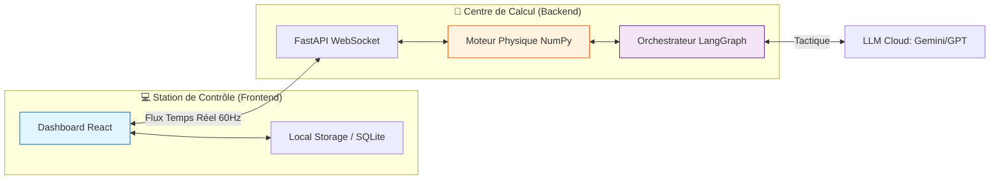
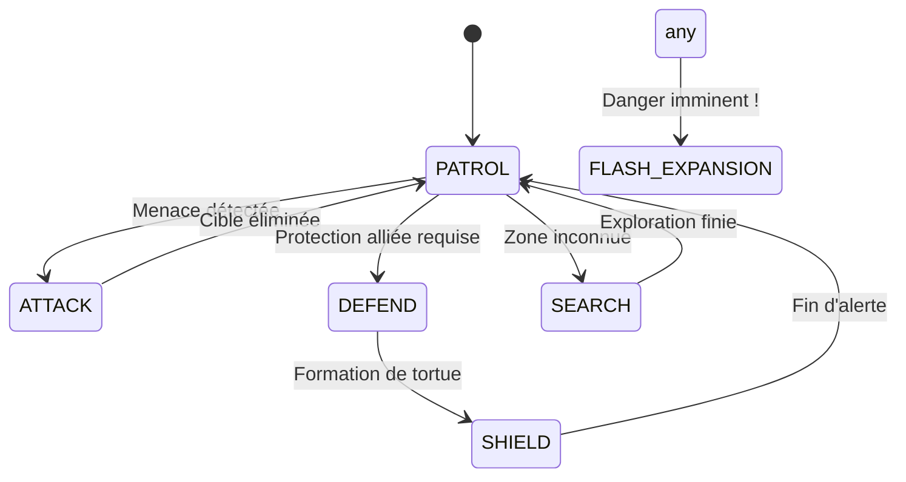

# 🌊 EssaimDrones (AquaSwarm) : Système de Commandement Tactique


**EssaimDrones** est une plateforme de simulation et de contrôle tactique pour essaims de drones sous-marins autonomes. Le système intègre des algorithmes biomimétiques (Hydro-Boids) et une orchestration par Intelligence Artificielle (LangGraph) pour des missions de surveillance, défense et exploration.

---

## 📋 Table des matières
1. [🎯 Présentation](#-présentation)
2. [🏗 Architecture du Système](#-architecture-du-système)
3. [🧠 Intelligence Collective & Modes](#-intelligence-collective--modes)
4. [✨ Fonctionnalités Clés](#-fonctionnalités-clés)
5. [🚀 Installation](#-installation)
6. [💻 Usage](#-usage)
7. [📖 Documentation](#-documentation)
8. [🧪 Tests & Qualité](#-tests--qualité)
9. [🗺 Roadmap](#-roadmap)

---

## 🎯 Présentation
Le projet vise à résoudre les défis de la coordination multi-agent en milieu sous-marin :
- **Dynamique des fluides** : Modélisation simplifiée des courants et de l'effet d'aspiration (drafting).
- **Autonomie Décisionnelle** : Chaque drone suit des règles locales simples produisant un comportement émergent complexe.
- **Supervision IA** : Un "Cerveau Global" (LLM) analyse les métriques de la flotte pour adapter la stratégie en temps réel.

---

## 🏗 Architecture du Système

L'écosystème est divisé en deux piliers technologiques majeurs :

### 🗂 Structure du Projet
```text
EssaimDrones/
├── Code/
│   ├── Backend/          # Moteur Python (FastAPI, NumPy, LangGraph)
│   └── Frontend/         # Interface React (Vite, Tailwind, Shadcn)
├── Cmd/                  # Scripts de déploiement et contrôle
├── Config/               # Configurations YAML globales
├── Doc/                  # Documentation technique (Sphinx)
└── Test/                 # Suite de tests (Pytest, Vitest)
```

### 🛰 Schéma de Flux de Données


---

## 🧠 Intelligence Collective & Modes

Le simulateur permet de basculer dynamiquement entre plusieurs comportements stratégiques.

### 🔄 Diagramme d'États des Modes


### 🛠 Modes détaillés
- **🛡️ SHIELD** : Les drones forment une sphère de protection autour d'une unité amie, alternant leurs positions pour optimiser la batterie.
- **🔍 SEARCH (PSO)** : Utilisation de l'optimisation par essaim de particules pour trouver des sources de chaleur ou de pollution.
- **🚀 FLASH_EXPANSION** : Les drones s'écartent instantanément du centre pour éviter une explosion ou un prédateur.
- **🐟 SCHOOLING** : Alignement parfait des vecteurs vitesse pour une navigation longue distance économe.

---

## ✨ Fonctionnalités Clés

| Fonctionnalité | Description | Technologie |
| :--- | :--- | :--- |
| **Vue Tactique 2D/3D** | Visualisation en temps réel des drones et obstacles. | React Canvas / SVG |
| **Agentic Command** | Chat interactif pour donner des ordres à l'essaim. | LangChain / LangGraph |
| **Drafting Bio** | Gain d'énergie en suivant le sillage d'un autre drone. | NumPy Vectorized |
| **Hot Swap LLM** | Changement de modèle IA (Gemini/GPT) sans redémarrer. | API Dynamic Provider |
| **Persistence** | Sauvegarde des configurations et logs de mission. | SQLite / LocalStorage |

---

## 🚀 Installation

### 1. Prérequis
- **Python 3.11+** (avec `pip` et `venv`)
- **Node.js 18+** (avec `npm`)
- Clé API **OpenRouter** (optionnelle mais recommandée pour l'IA)

### 2. Configuration Rapide
```bash
# Cloner le dépôt
git clone https://github.com/dagornc/EssaimDrones.git
cd EssaimDrones

# Installer le backend
python3 -m venv .venv
source .venv/bin/activate
pip install -r requirements.txt

# Installer le frontend
cd Code/Frontend
npm install
```

### 3. Environnement
Créez un fichier `.env` à la racine :
```env
OPENROUTER_API_KEY=votre_cle_api
LLM_PROVIDER=openrouter
LLM_MODEL=google/gemini-2.0-flash-exp:free
```

---

## 💻 Usage

### ⚡ Lancement Automatique
Le script `start.sh` gère tout pour vous (vérification des clés, démarrage des services, ouverture de Chrome) :
```bash
chmod +x start.sh
./start.sh
```

### 🛠 Lancement Manuel
**Terminal 1 (Backend)** :
```bash
cd Code/Backend
python -m uvicorn api.main:app --reload --port 8000
```

**Terminal 2 (Frontend)** :
```bash
cd Code/Frontend
npm run dev
```

---

## 📖 Documentation

La documentation technique est générée automatiquement à partir des docstrings du code.

### 🏗 Générer avec Sphinx
```bash
cd Doc/sphinx
make html
```
Les fichiers sont accessibles dans `Doc/sphinx/_build/html/index.html`.

---

## 🧪 Tests & Qualité

Nous maintenons une "Quality Gate" stricte pour assurer la fiabilité des comportements de l'essaim.

### 📊 Suite de tests
- **Unitaires (Backend)** : `pytest Test/`
- **Unitaires (Frontend)** : `npm run test` (Vitest)
- **Typage** : `mypy Code/Backend`
- **Couverture** : `pytest --cov=Code/Backend` (Objectif > 95%)

### 🛡️ SonarQube
Le projet est prêt pour l'analyse Sonar via le fichier `sonar-project.properties`.
```bash
sonar-scanner
```

---

## 🗺 Roadmap
- [ ] **Phase 1** : Amélioration de la physique hydrodynamique (turbulences).
- [ ] **Phase 2** : Intégration de modèles de drones hétérogènes (Drones-Mères, Mini-Scouts).
- [ ] **Phase 3** : Déploiement sur hardware réel (ROS2 / ESP32-Sub).

---
*Développé avec ❤️ pour l'innovation sous-marine.*
> **Contact** : [Dagornc sur GitHub](https://github.com/dagornc)
