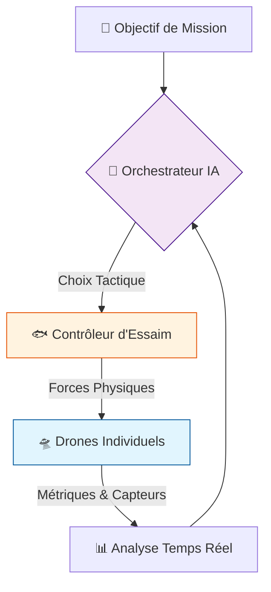
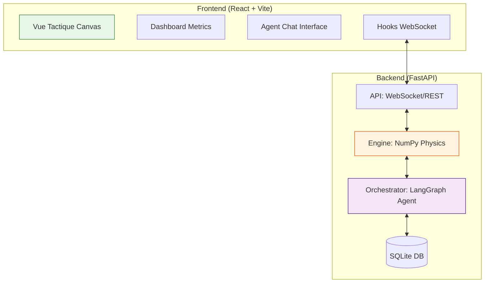
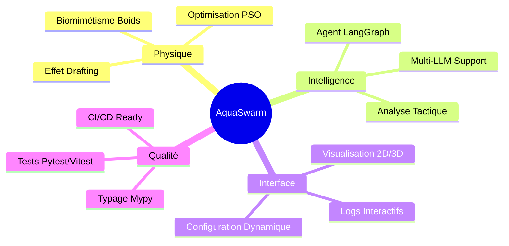
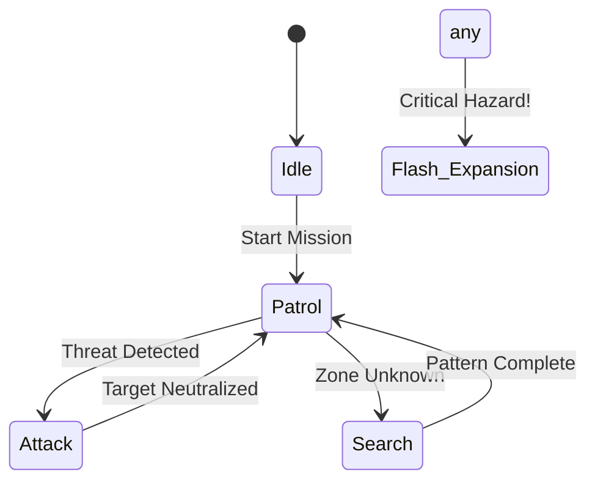
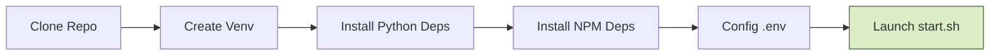
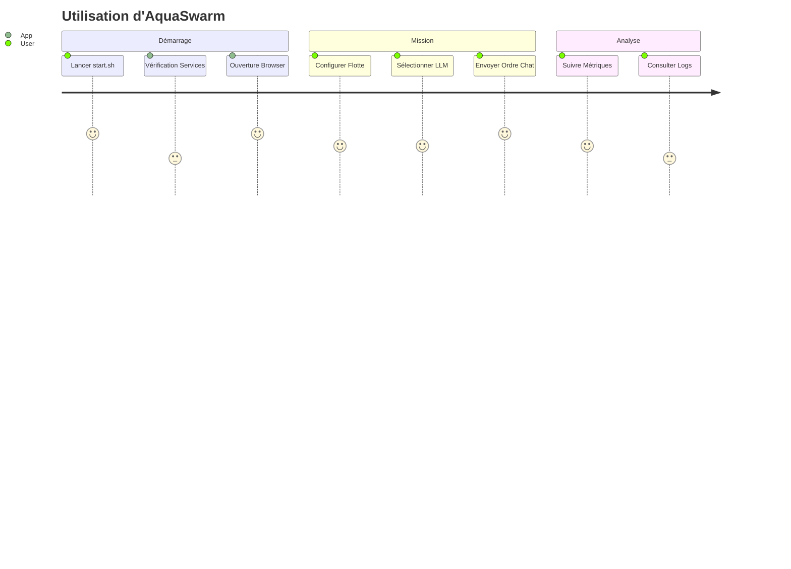
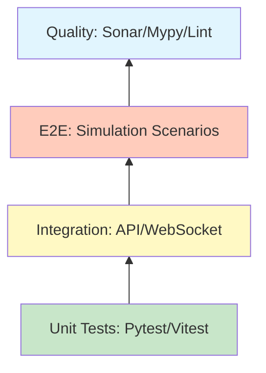

# 🌊 EssaimDrones (AquaSwarm) : Système de Commandement Tactique


**EssaimDrones** est une plateforme de simulation et de contrôle tactique pour essaims de drones sous-marins autonomes. Le système intègre des algorithmes biomimétiques (Hydro-Boids) et une orchestration par Intelligence Artificielle (LangGraph) pour des missions de surveillance, défense et exploration.

---

## 📋 Table des matières
1. [🎯 Présentation](#-présentation)
2. [🏗 Architecture du Système](#-architecture-du-système)
3. [✨ Fonctionnalités Clés](#-fonctionnalités-clés)
4. [🧠 Intelligence Collective & Modes](#-intelligence-collective--modes)
5. [🚀 Installation](#-installation)
6. [💻 Usage](#-usage)
7. [🧪 Tests & Qualité](#-tests--qualité)
8. [📖 Documentation](#-documentation)
9. [🗺 Roadmap](#-roadmap)

---

## 🎯 Présentation

Le projet **EssaimDrones** vise à simuler des comportements collectifs complexes au sein d'une flotte de drones sous-marins. Contrairement aux approches centralisées classiques, AquaSwarm repose sur l'émergence de comportements à partir de règles locales simples, supervisées par une IA tactique de haut niveau.

### 🌀 Le Cycle de Commandement


---

## 🏗 Architecture du Système

L'architecture est conçue pour la performance et l'extensibilité, utilisant **FastAPI** pour la communication asynchrone et **NumPy** pour les calculs vectorisés.

### 🧱 Décomposition des Composants


---

## ✨ Fonctionnalités Clés

Le système AquaSwarm offre un ensemble complet d'outils pour la gestion d'essaims :



---

## 🧠 Intelligence Collective & Modes

L'essaim peut adopter différentes formations et stratégies selon la situation.

### ⚔️ Modes de Combat & Formations
| Mode | Schéma Conceptuel | Description |
| :--- | :--- | :--- |
| **PATROL** | `⸫ ⸪ ⸬` | Dispersion optimisée pour couvrir une zone maximale. |
| **ATTACK** | `▶ ▶ ▶` | Formation en pointe (wedge) pour percer une défense. |
| **SHIELD** | `( ⦿ )` | Formation sphérique dense autour d'une cible alliée. |
| **ENCIRCLE**| `⟳ ⦿ ⟲` | Encerclement tangentiel pour neutraliser une cible. |

### 🔄 Logique de Transition


---

## 🚀 Installation

L'installation est simplifiée par l'utilisation d'environnements virtuels et de gestionnaires de paquets modernes.

### 🛠 Workflow d'Installation


1. **Backend** : `pip install -r requirements.txt`
2. **Frontend** : `cd Code/Frontend && npm install`
3. **Variables** : Configurer la clé `OPENROUTER_API_KEY` dans le fichier `.env`.

---

## 💻 Usage

### 🎮 Expérience Utilisateur


- **Automatique** : `./start.sh` (recommandé).
- **Manuel** : Lancer `uvicorn` (port 8000) et `npm run dev` (port 5173).

---

## 🧪 Tests & Qualité

La robustesse du système est garantie par une suite de tests complète couvrant tous les niveaux de l'application.

### 📐 Pyramide des Tests


### Commandes utiles :
- `pytest Test/` : Lance les tests unitaires backend.
- `npm run test` : Lance les tests unitaires frontend.
- `mypy Code/Backend` : Vérification du typage statique.

---

## 📖 Documentation

Consultez la documentation technique complète générée via **Sphinx** pour plus de détails sur les classes et algorithmes.

```bash
cd Doc/sphinx
make html
```

---

## 🗺 Roadmap
- [ ] **2024.Q4** : Support Multi-Swarm (Flottes adverses).
- [ ] **2025.Q1** : Intégration de modèles de drones 3D complexes.
- [ ] **2025.Q2** : Déploiement Cloud (Docker/K8s).

---
*Développé avec ❤️ pour l'innovation sous-marine.*
> **Contact** : [Dagornc sur GitHub](https://github.com/dagornc)
