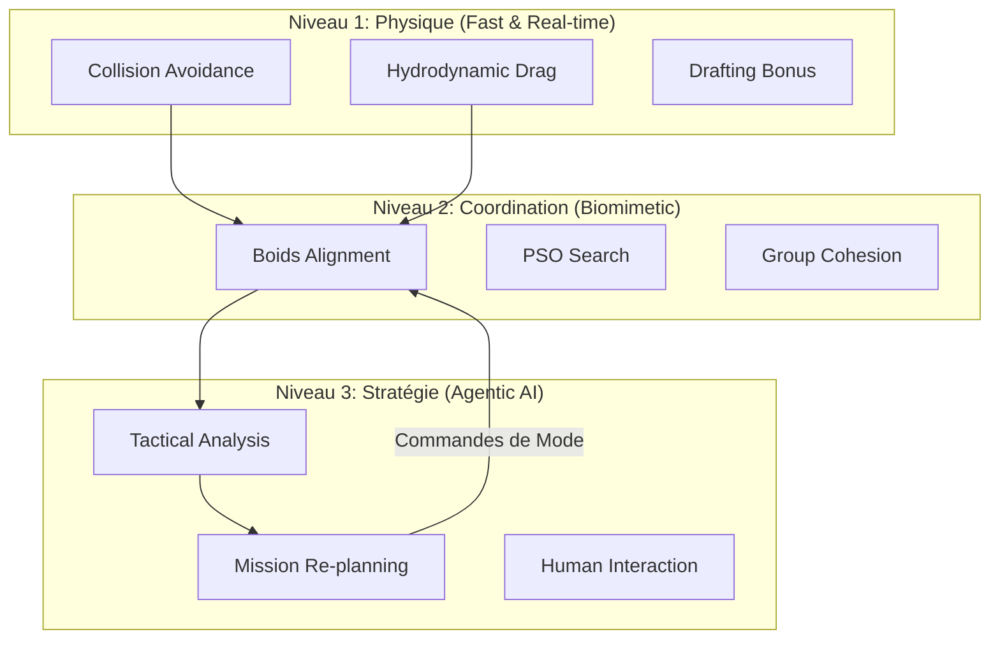
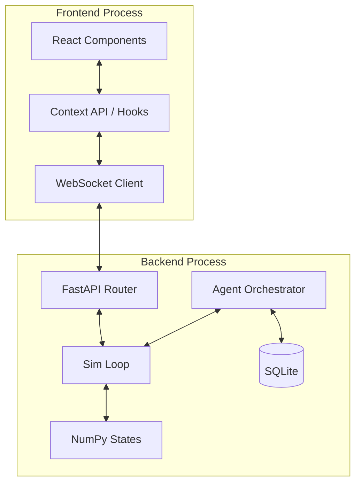

# 🌊 EssaimDrones (AquaSwarm) : Système de Commandement Tactique Avancé


**EssaimDrones** (alias **AquaSwarm**) est une plateforme logicielle de pointe dédiée à la recherche, la simulation et le déploiement tactique d'essaims de drones sous-marins autonomes (AUV). Ce projet fusionne les principes de l'**intelligence collective biomimétique**, la **dynamique des fluides numérique** et l'**orchestration par Intelligence Artificielle générative**.

---

## 📋 Table des matières
1. [🎯 Présentation exhaustive](#-présentation-exhaustive)
2. [✨ Fonctionnalités détaillées](#-fonctionnalités-détaillées)
3. [🏗 Architecture logicielle profonde](#-architecture-logicielle-profonde)
4. [🧠 Intelligence Collective & Modes Tactiques](#-intelligence-collective--modes-tactiques)
5. [🚀 Installation & Configuration complète](#-installation--configuration-complète)
6. [💻 Guide d'Usage & Interaction utilisateur](#-guide-dusage--interaction-utilisateur)
7. [🧪 Tests, Qualité & Fiabilité logicielle](#-tests-qualité--fiabilité-logicielle)

---

## 🎯 Présentation exhaustive

### Genèse et Vision du Projet
Le projet **EssaimDrones** est né d'un constat simple mais alarmant : la gestion traditionnelle des flottes sous-marines repose encore trop souvent sur un contrôle centralisé, vulnérable et peu flexible. Dans les environnements abyssaux, où les communications par ondes radio sont quasi-inexistantes (remplacées par l'acoustique lente) et où la visibilité est nulle, la coordination d'un grand nombre d'agents devient un cauchemar logistique. AquaSwarm propose un changement de paradigme radical en s'appuyant sur l'**émergence de comportements**.

Notre vision est de transformer une multitude d'agents simples en un super-organisme intelligent capable de s'adapter à l'imprévu sans intervention humaine constante. Que ce soit pour la surveillance de câbles sous-marins critiques, la dépollution océanique ou la recherche d'épaves, AquaSwarm offre un cadre robuste et évolutif.

### Les Spécificités du Milieu Sous-marin
Contrairement aux simulations aériennes classiques, AquaSwarm modélise les contraintes physiques uniques de l'hydrodynamique :
- **Inertie et Masse Ajoutée** : Le mouvement dans l'eau nécessite de déplacer une masse de fluide importante. La simulation intègre des calculs d'accélération tenant compte de la densité du milieu.
- **Phénomènes de Sillage** : La simulation implémente l'**effet d'aspiration (drafting)**. Lorsqu'un drone suit un autre agent, son coefficient de traînée est réduit, simulant les économies d'énergie réelles observées dans les bancs de thons ou de dauphins.
- **Turbulences et Courants** : Le système est conçu pour intégrer des champs de vecteurs de courant, modifiant la trajectoire passive des drones et forçant l'intelligence collective à compenser ces dérives.

### L'Approche Agentic-Centric
Le projet ne se contente pas de simuler des points dans l'espace. Chaque drone est un agent autonome avec ses propres "capteurs" (virtuels) et son propre budget énergétique. L'innovation majeure réside dans le couplage entre cette physique "bas niveau" et une intelligence "haut niveau" portée par des **LLM (Large Language Models)**. Ce "Cerveau Tactique" n'a pas besoin de connaître la position exacte de chaque drone à chaque milliseconde ; il donne des intentions stratégiques, laissant l'intelligence collective locale gérer la micro-navigation et l'évitement d'obstacles.



---

## ✨ Fonctionnalités détaillées

### 1. Moteur de Simulation Vectorisé (NumPy Engine)
Le cœur du système est un moteur de simulation écrit en Python pur mais optimisé via **NumPy**. Tous les calculs de forces (séparation, alignement, cohésion, évitement) sont effectués sur des matrices N-dimensionnelles.
- **Performance** : Capacité de gérer plus de 500 agents à 60 FPS sur un CPU moderne.
- **Précision** : Utilisation de l'intégration d'Euler pour des trajectoires fluides et prévisibles.
- **Scalabilité** : Ajout dynamique de drones en cours de simulation sans interruption du flux WebSocket.

### 2. Orchestrateur IA (LangGraph & LangChain)
L'intelligence de l'essaim est pilotée par un agent conversationnel sophistiqué :
- **Analyse de Métriques** : L'IA reçoit périodiquement des données sur la cohésion (distance moyenne au centre) et l'alignement (parallélisme des vecteurs vitesse).
- **Prise de Décision** : Si l'IA détecte une désorganisation (cohésion faible), elle peut automatiquement basculer l'essaim en mode **SCHOOLING** ou **DEFEND**.
- **Support Multi-Modèles** : Intégration transparente avec GPT-4, Claude 3.5 et Gemini 2.0 via OpenRouter.
- **Mémoire de Mission** : L'agent conserve l'historique des ordres pour assurer une continuité tactique.

### 3. Interface de Contrôle (Dashboard Tactique)
Le frontend React offre une suite d'outils visuels professionnels :
- **Visualisation 2D/3D** : Un canvas haute performance affichant les drones, leurs vecteurs de vitesse, les obstacles et les zones de cibles.
- **Graphiques Temps Réel** : Suivi des KPIs (Key Performance Indicators) via Recharts.
- **Sélecteur de Modèle Dynamique** : Une interface dédiée pour tester différents LLM et ajuster leurs paramètres (température, système prompt).
- **Console de Logs** : Flux en direct des événements système et des dialogues de l'Agent IA.

### 4. Environnement Dynamique
- **Gestion des Obstacles** : Placement dynamique d'obstacles circulaires/sphériques avec évitement par champs de force.
- **Unités Amies (Friends)** : Support pour des unités statiques ou mobiles que l'essaim doit protéger (mode SHIELD).
- **Cibles (Targets)** : Cibles mobiles erratiques pour tester les capacités d'interception de l'essaim.

---

## 🏗 Architecture logicielle profonde

### Découplage et Design Patterns
AquaSwarm suit une architecture modulaire basée sur plusieurs patterns classiques :
- **Strategy Pattern** : Utilisé pour les comportements de l'essaim (`behaviors.py`). On peut changer l'algorithme de calcul des forces à la volée sans modifier la classe `Simulation`.
- **Observer Pattern** : Le serveur FastAPI diffuse l'état de la simulation à tous les clients WebSockets connectés.
- **Factory Pattern** : Pour l'initialisation des modèles LLM selon le fournisseur choisi.

### Le Stack Backend (Python / FastAPI)
FastAPI sert de colonne vertébrale pour les communications asynchrones. 
- **WebSocket Loop** : Une boucle asynchrone tourne à 60Hz, calculant l'état et le diffusant.
- **API REST** : Gère la persistance des fournisseurs de modèles LLM dans une base SQLite locale via `aiosqlite`.
- **Pydantic Models** : Validation stricte de toutes les données entrantes et sortantes, assurant une robustesse totale face aux données corrompues.

### Le Stack Frontend (React / TypeScript)
- **Vite** : Pour une compilation ultra-rapide et un rechargement à chaud (HMR).
- **Tailwind CSS** : Pour une interface moderne, responsive et compatible avec le mode sombre/clair.
- **React Hooks Personnalisés** : `useWebSocket` gère la reconnexion automatique et la mise en tampon des données. `useMissionTimer` gère le chronométrage précis des opérations.



---

## 🧠 Intelligence Collective & Modes Tactiques

### Physique des Comportements Émergents
L'essaim obéit à quatre forces fondamentales pondérées dynamiquement :
1. **Séparation ($F_{sep}$)** : Éloigne le drone de ses voisins s'ils sont trop proches (rayon de crowding).
2. **Alignement ($F_{ali}$)** : Oriente le drone dans la direction moyenne de ses voisins locaux.
3. **Cohésion ($F_{coh}$)** : Attire le drone vers le centre de masse de ses voisins.
4. **Attraction de Cible ($F_{tar}$)** : Dirige le drone vers l'objectif de mission.

### Modes Spécialisés
- **🛡️ SHIELD / DEFEND** : Les drones se placent sur une orbite circulaire autour d'une unité amie. Ils utilisent des forces tangentielles pour créer un mouvement de rotation continu, rendant l'essaim difficile à pénétrer.
- **🔍 SEARCH (PSO - Particle Swarm Optimization)** : Chaque drone se souvient de sa meilleure position trouvée (fitness) et communique avec ses voisins pour converger vers l'optimum global. Parfait pour la détection de fuites chimiques ou de sources de chaleur.
- **🚀 FLASH EXPANSION** : En cas de danger immédiat, les drones reçoivent une impulsion de force radiale massive. Un système de "cool-down" empêche les activations répétitives instables.
- **📐 ENCIRCLE** : Similaire au mode SHIELD mais focalisé sur une cible hostile, avec une réduction progressive du rayon pour restreindre les mouvements de l'adversaire.

---

## 🚀 Installation & Configuration complète

### Installation pas à pas (Système Unix / MacOS)

1. **Clonage du Dépôt** :
   ```bash
   git clone https://github.com/dagornc/EssaimDrones.git
   cd EssaimDrones
   ```

2. **Configuration Python** :
   Il est fortement conseillé d'utiliser un environnement virtuel pour isoler les dépendances.
   ```bash
   python3 -m venv .venv
   source .venv/bin/activate
   pip install --upgrade pip
   pip install -r requirements.txt
   ```

3. **Configuration Node.js** :
   Assurez-vous d'avoir Node 18+ installé.
   ```bash
   cd Code/Frontend
   npm install
   cd ../..
   ```

### Configuration des Clés API
Le fichier `.env` à la racine doit contenir vos accès aux LLM. Si vous utilisez **OpenRouter**, vous aurez accès à des dizaines de modèles (dont certains gratuits comme Gemini Flash ou Llama 3).
```env
OPENROUTER_API_KEY=sk-or-v1-xxxxxxxx...
LLM_PROVIDER=openrouter
LLM_MODEL=google/gemini-2.0-flash-exp:free
```

---

## 💻 Guide d'Usage & Interaction utilisateur

### Le Script de Lancement Magique
Pour simplifier l'expérience, utilisez le script `start.sh`. Il effectue les tâches suivantes :
- Vérifie la présence de l'environnement virtuel.
- Installe les dépendances manquantes.
- Teste la connectivité avec l'API LLM pour éviter les erreurs silencieuses.
- Lance le Backend et le Frontend en parallèle.
- Ouvre automatiquement votre navigateur par défaut sur l'application.

```bash
chmod +x start.sh
./start.sh
```

### Scénario de Mission Type
1. **Configuration** : Dans l'onglet Configuration, réglez la taille de la flotte à 50 drones.
2. **Sélection IA** : Choisissez "Gemini 2.0" comme commandant.
3. **Observation** : Allez sur le Dashboard et observez l'essaim en mode PATROL.
4. **Intervention** : Dans le chat, tapez : "Une menace approche par le Nord, passez en mode DEFEND autour de l'unité amie".
5. **Analyse** : Regardez le graphique de cohésion augmenter tandis que les drones se regroupent en formation circulaire.

---

## 🧪 Tests, Qualité & Fiabilité logicielle

### Stratégie de Test Multi-Niveaux
Le projet AquaSwarm maintient une couverture de code élevée pour garantir la sécurité des algorithmes :
- **Tests de Physique** : Vérifient que les forces calculées par NumPy n'entraînent pas de valeurs infinies (NaN) et respectent les limites de vitesse (`MAX_SPEED`).
- **Tests d'API** : Simulent des clients WebSockets pour vérifier que le serveur gère correctement les déconnexions brutales.
- **Tests d'Intégration LLM** : Vérifient que l'Agent IA est capable de parser correctement les métriques et de retourner des appels de fonctions valides.

### Outils de Qualité
- **Mypy** : Utilisé pour le typage statique strict du code Python, évitant 90% des erreurs d'exécution classiques.
- **Flake8 / ESLint** : Garantissent un style de code cohérent et lisible pour tous les contributeurs.
- **SonarQube** : Les rapports de couverture et de qualité sont générés via `sonar-scanner` pour assurer une maintenance sur le long terme.

```bash
# Lancer les tests avec rapport de couverture
pytest --cov=Code/Backend Test/
# Vérifier la qualité statique
mypy Code/Backend
```

---
*Développé avec passion pour l'exploration des frontières de l'intelligence collective.*
> **Développeur** : [Dagornc](https://github.com/dagornc) | **Version** : 1.2.0-Alpha
