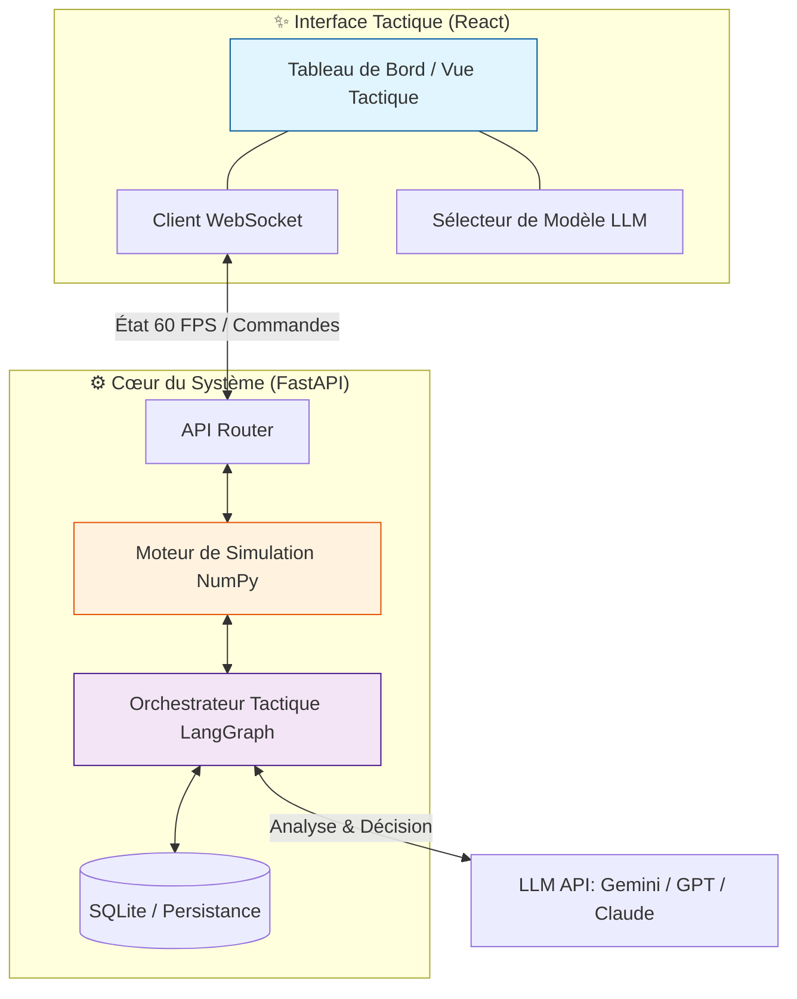
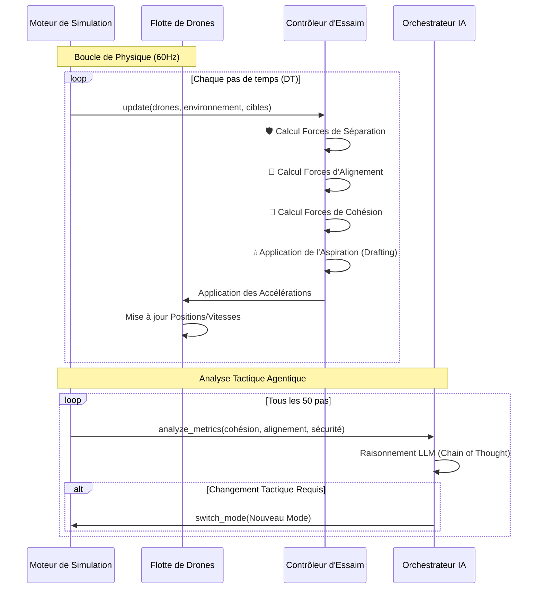

# 🌊 EssaimDrones : Système Avancé de Commandement d'Essaims Sous-marins


**EssaimDrones** (alias **AquaSwarm**) est une plateforme de pointe pour la simulation, la visualisation et le commandement d'essaims de drones sous-marins autonomes. Alliant **comportements biomimétiques**, **optimisation hydrodynamique** et **intelligence artificielle multi-agent**, le projet repousse les limites de la coordination collective en milieu hostile.

---

## 🏗 Architecture du Système

L'architecture repose sur une séparation nette entre le moteur de simulation physique (Backend) et l'interface de contrôle tactique (Frontend), reliés par une communication bidirectionnelle haute performance via WebSockets.



---

## 🧠 Intelligence Collective & Biomimétisme

Le simulateur utilise des modèles mathématiques avancés pour reproduire les comportements observés dans la nature (bancs de poissons, vols d'oiseaux).

### 📐 Logique de Simulation
Le flux de contrôle suit une boucle rigoureuse pour garantir la fluidité et la précision physique :



### 🛠 Modes de Comportement
- **🛡️ DEFEND / SHIELD** : Formation compacte autour d'une cible alliée avec rotation orbitale.
- **⚔️ ATTACK / PREDATOR_PACK** : Alignement agressif et encerclement de la menace.
- **🔍 SEARCH / EXPLORATION** : Algorithme **PSO (Particle Swarm Optimization)** pour couvrir un maximum de surface.
- **🚀 FLASH_EXPANSION** : Dispersion d'urgence en cas de détection de mine ou danger imminent.
- **🐟 SCHOOLING** : Comportement biomimétique pur pour une navigation fluide.

---

## ✨ Fonctionnalités Clés

### 📟 Tableau de Bord Tactique
- **Visualisation 2D/3D** : Suivi en temps réel de chaque drone, obstacle et cible.
- **Métriques Avancées** : Graphiques de cohésion, alignement de la flotte et état des batteries.
- **Contrôle Manuel** : Possibilité de placer des obstacles ou des cibles par simple clic sur la carte.

### 🤖 Orchestrateur IA (LangGraph)
Le système intègre un agent intelligent capable de :
- Analyser les performances de l'essaim.
- Prendre des décisions stratégiques (ex: passer en mode DEFEND si la menace approche).
- Dialoguer avec l'opérateur via une interface de chat intégrée.

### 🌊 Optimisation Hydrodynamique
- **Effet d'Aspiration (Drafting)** : Les drones consomment moins d'énergie lorsqu'ils se déplacent dans le sillage de leurs congénères.
- **Gestion des Collisions** : Évitement d'obstacles basé sur des champs de forces répulsifs.

---

## 🚀 Installation & Lancement

### 1. Prérequis
- Python 3.11+
- Node.js 18+
- Une clé API (OpenRouter/OpenAI/Gemini) pour les fonctions IA.

### 2. Installation Rapide
```bash
git clone https://github.com/dagornc/EssaimDrones.git
cd EssaimDrones

# Création de l'environnement virtuel
python3 -m venv .venv
source .venv/bin/activate
pip install -r requirements.txt

# Installation du Frontend
cd Code/Frontend
npm install
```

### 3. Configuration
Créez un fichier `.env` à la racine :
```env
OPENROUTER_API_KEY=votre_cle_ici
LLM_PROVIDER=openrouter
LLM_MODEL=google/gemini-2.0-flash-exp:free
```

### 4. Lancement
Utilisez le script tout-en-un :
```bash
chmod +x start.sh
./start.sh
```

---

## 🧪 Qualité & Tests

Le projet suit des standards industriels de qualité de code :
- **Typage Statique** : Vérification stricte avec `mypy`.
- **Tests Unitaires** : Couverture > 95% via `pytest` et `vitest`.
- **Analyse Continue** : Intégration SonarQube via `sonar-project.properties`.

```bash
# Lancer les tests backend
pytest Test/

# Lancer les tests frontend
cd Code/Frontend
npm run test
```

---

## 🗺 Roadmap
- [ ] Support VR/AR pour la visualisation tactique.
- [ ] Intégration de modèles météo sous-marine (courants variables).
- [ ] Simulation multi-flottes (affrontements d'essaims).

> **Note :** Ce projet a été conçu avec une approche Lean et une architecture modulaire pour permettre une extension facile des comportements de drones.

---
*© 2026 EssaimDrones Project - Développé avec ❤️ par l'Agent Antigravity*
